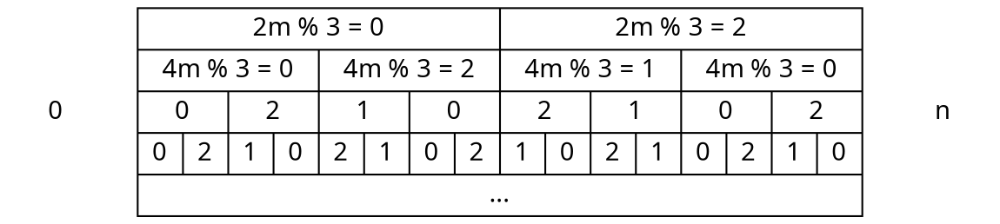

# HW2 writeup

## RSA
本題 RSA 的 $N$ 是 3 個質數相乘得到的。第一個質數 $2p$ 是隨機產生的 512 bit 質數，第二個質數 $q1$ 是比 $2p$ 還大的下一個質數，第三個質數 $q2$ 是比 $3q1$ 還大的下一個質數。由於選取質數的方法是選擇下個比它大的質數，因此 $q3 - 2p$，$q2 - 3q1$ 的值會很小。也就是說，我們可以假設 $q1 = 2p + e1$, $q2 = 3 * q1 + e2$，其中 $e1$，$e2$ 是很小的數。這樣一來，我們可以選擇暴力猜測 $e1$ 和 $e2$，那我們的方程式就會是：

$N = p \cdot q1 \cdot q2 = p \cdot (2p + e1) \cdot (3q1 + e2) = p \cdot (2p + e1) \cdot (3 \cdot (2p + e1) + e2)$

這格方程式的未知數就會只剩下 p 。隨後，我們將方程式帶進 sage 解看看，如果解的出來的話，那個 root 的值就是 p 了。一旦 p 解出來後，q1 & q2 也解出來了，我們可以近一步得到 ϕ，然後取得私鑰 d 還原原文。

### script
```bash
sage -python3 rsa.py
```
## LSB
本題和課堂上講到的 LSB oracle 很相似，只是回傳的不是 mod 2 的結果，而是 mod 3 的結果。其實本題的做法和典型的 LSB oracle 做法類似，只是我們需要將 mod 3 的結果推論 m 所在的區間。首先，我們先假設 $m \equiv 0 \pmod 3$ 以及 $n \equiv 1 \pmod 3$（這樣分析起來比較方便）。如果不是的話再重新連一次就行了。我們假設如果 $m$ 在 $[0, \frac{n}{2})$ 的區間的話，那 $2m$ 就會在 $[0, n)$ 之間，因此 $2m \mod n$ 相當於 $2m$ 。因為我們假設 $m \mod 3$ 是 0，因此 $2m \mod 3$ 的值會是 $0$。同樣的，如果我們假設 $m$ 在 $[\frac{n}{2}, n)$ 的區間的話，那 $2m$ 就會在 $[n, 2n)$ 之間，因此 $2m \mod n$ 相當於 $2m - n$ 。因為我們假設 $m \mod 3$ 是 0 以及 $n \mod 3 == 1$，因此 $2m \mod 3$ 的值會是 $2$。

依樣畫葫蘆，假設 
* m 在 $[0, n / 4)$ 的區間的話，那 $2m$ 就會在 $[0, n)$ 之間，因此 $4m \mod n$ 相當於 $4m$ 。根據假設 $4m \mod 3$ 的值會是 $0$。
* m 在 $[n / 4, n / 2)$ 的區間的話，那 4m 就會在 $[n, 2n)$ 之間，$4m \mod n$ 相當於 $4m - n$ 。根據假設 $4m \mod 3$ 的值會是 2。
* m 在 $[n / 2, 3n / 4)$ 的區間的話，那 4m 就會在 $[2n, 3n)$ 之間，$4m \mod n$ 相當於 $4m - 2n$ ，根據假設 $4m \mod 3$ 的值會是 $1$。
* m 在 $[3n / 4, n)$ 的區間的話，那 4m 就會在 $[3n, 4n)$ 之間，$4m \mod n$ 相當於 $4m - 3n$ ，根據假設 $4m \mod 3$ 的值會是 $0$。

根據以上的推論不難可以推出以下的規律：

剩下的部分就和上課提到的一樣。
### script
```
python3 lsb.py
```
